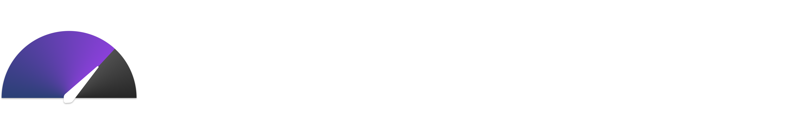

<p align="center">
  
</p>

<p align="center">
  
  
  
  
</p>

---

**SpeedTest Tray** is a lightweight, high-performance system tray application designed for running on-demand internet speed tests from a compact, modern window. Built with Go and Wails, it combines native performance with a vibrant, hardware-accelerated UI.

<p align="center">
  
</p>

## 📑 Table of Contents

- [Key Features](#-key-features)
- [Installation](#-installation)
- [Usage](#-usage)
- [Tech Stack](#-tech-stack)
- [Project Layout](#-project-layout)
- [Roadmap](#-roadmap)
- [Development](#-development)
- [License](#-license)

## ✨ Key Features

- **System Tray Integration**: Stays docked in your taskbar, launching a focused window only when needed.
- **Modern Speedometer UI**: Features a custom-built, modular solid-sector gauge with a real-time synchronized kite needle.
- **Vibrant Aesthetic**: Premium dual-accent gradient theme with color-matched bloom effects and softened shadows.
- **Dynamic Scaling**: Automatically adjusts its scale for Download (1000 Mbps) and Upload (100 Mbps) phases for optimal visual feedback.
- **Immediate Termination**: Dedicated "Stop" button for instant test cancellation and UI reset.
- **Persistent Logging**: Configurable file-based logging stored in your system's application data folder.

## 🚀 Installation

### Windows (Recommended)
1. Download the latest `speedtest-tray.exe` from the [**Releases**](https://github.com/AarZoooo/speedtest-tray/releases) page.        
2. Run the executable. It will automatically initialize in your system tray.

### From Source
If you prefer to build it yourself, ensure you have [Go](https://go.dev/) and [Wails](https://wails.io/) installed.

```powershell
# Clone the repository
git clone https://github.com/aarju/speedtest-tray.git
cd speedtest-tray

# Build the application
wails build
```

## 💡 Usage

1. **Launch**: Open the app; it will appear as a speedometer icon in your system tray.
2. **Start Test**: Click the tray icon (or right-click → Open) to bring up the window, then hit **Start**.
3. **Monitor**: Watch real-time progress as the needle synchronizes with your network throughput.
4. **Stop**: Click **Stop** at any time to abort the test.
5. **Logs**: View your test history in your `%APPDATA%/SpeedTest Tray` folder (on Windows).

## 🛠 Tech Stack

- **Backend**: [Go](https://go.dev/)
- **Frontend**: [Wails v2](https://wails.io/) (HTML/CSS/JS)
- **Speed Test Engine**: `speedtest-go`
- **System Tray**: `energye/systray`
- **UI Components**: Vanilla Web Components

## 📁 Project Layout

```text
.
├── main.go                    # Wails and tray entry point
├── internal/config/           # Centralized configuration and constants
├── internal/gui_wails/        # Wails backend bindings and window integration
├── internal/speedtest_util/   # Speed test core logic and orchestration
├── frontend/                  # Modularized UI assets and Web Components
├── docs/                      # Architecture and design documentation
└── build/windows/             # Windows icon and Wails build metadata
```

## 🗺 Roadmap

- [ ] **CLI Interface**: Add `--cli` flag for headless speed tests with JSON output.
- [ ] **History View**: Implement local persistence (SQLite) to visualize performance trends.
- [ ] **Error Recovery**: Add retry logic for transient network failures.
- [ ] **Hardware Correlation**: Correlate system performance (CPU/RAM) with test results.

## 🛠 Development

Run in development mode with hot-reload:
```powershell
wails dev
```

Run unit tests:
```powershell
go test ./internal/...
```

## 📄 License

This project is licensed under the MIT License - see the [LICENSE](LICENSE) file for details.
